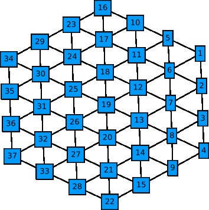
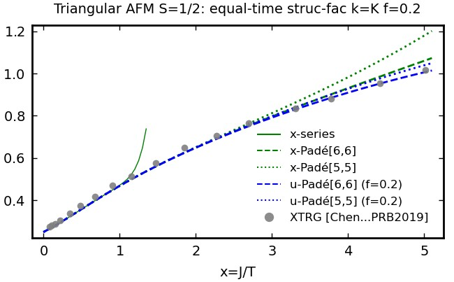
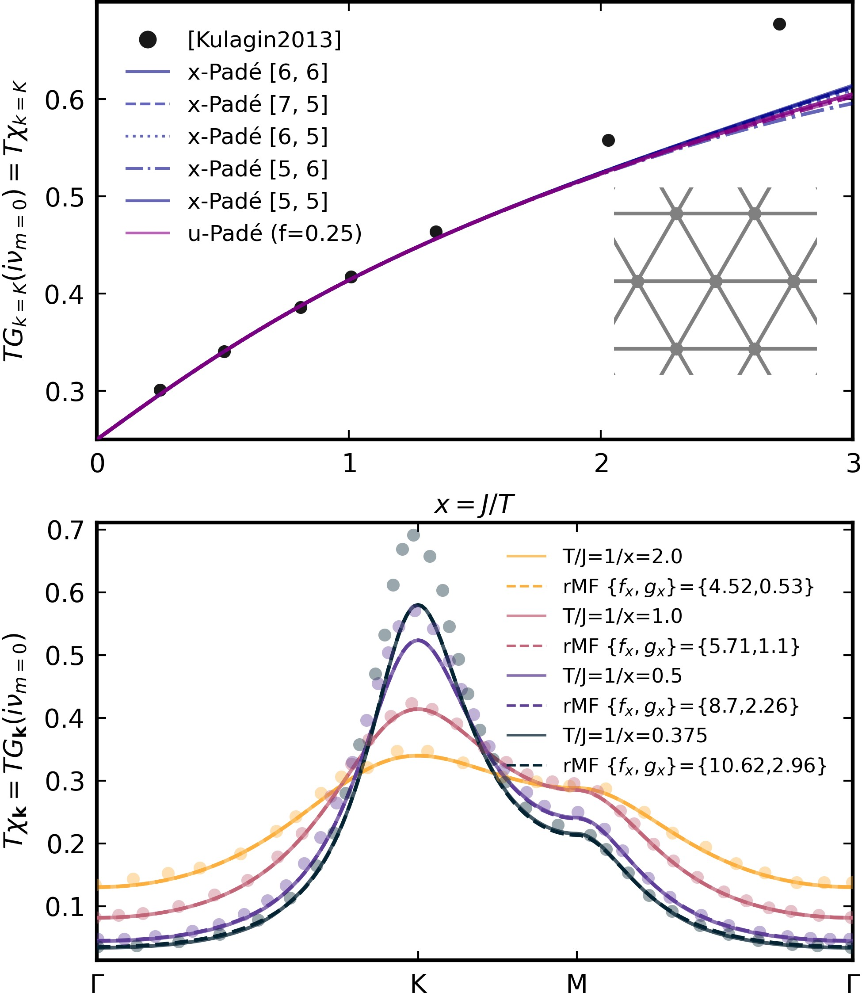
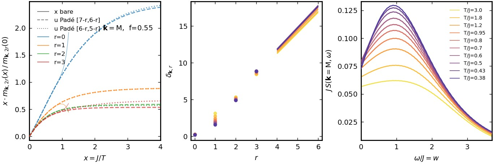
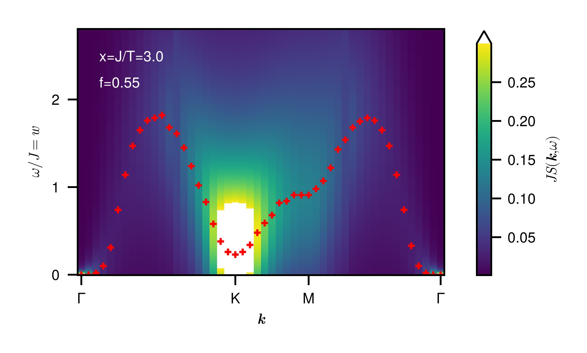

# Dynamic high-temperature expansion for quantum spins (Dyn-HTE) 

by Ruben Burkard, Benedikt Schneider, Björn Sbierski 

This software allows to compute dynamic spin correlations of spin-S Heisenberg models in thermal equilibrium via a high-temperature expansion (HTE) of the Matsubara spin-spin correlator. It is currently applicable for $S \leq 1$ models with a single coupling constant $J$, but arbitrary lattice geometry.

$$ H=J\sum_{(ii^\prime)}\left(S_{i}^{+}S_{i^\prime}^{-}+S_{i}^{-}S_{i^\prime}^{+}+S_{i}^{z}S_{i^\prime}^{z}\right) $$

Dyn-HTE obtains the HTE of the Matsubara spin-spin correlator

$$ G_{ii^\prime}(i\nu_{m})=T  \int_{0}^{\beta} \mathrm{d}\tau\mathrm{d}\tau^{\prime}\,e^{i\nu_{m}(\tau-\tau^{\prime})} 
\left\langle \mathcal{T}S_{i}^{z}(\tau)S_{i^{\prime}}^{z}(\tau^{\prime})\right\rangle $$

and allows to post-process this information to find the dynamic spin structure factor (DSF)

$$ S(\mathbf{k},\omega) = \int_{-\infty}^{+\infty}  \frac{\mathrm{d}t}{2\pi N} \sum_{i,i^\prime}  exp(i\omega t-i\mathbf{k}\cdot(r_i - r_{i^\prime}))  \left\langle S_{i}^{z}(t)S_{i^\prime}^{z}\right\rangle $$


## Publication/Citation
The theory background for Dyn-HTE and various applications are provided in the following two publications:

[1] Ruben Burkard, Benedikt Schneider, Björn Sbierski, *Dyn-HTE: High-temperature expansion of the dynamic Matsubara spin correlator*, arxiv 2025.YYYYY (2025)

[2] Ruben Burkard, Benedikt Schneider, Björn Sbierski, *Dynamic correlations of frustrated quantum spins from high-temperature expansion*, arxiv 2025.XXXXX (2025)

If Dyn-HTE benefits your research, please acknowledge it by citing these references.

## Tutorial: Spin-1/2 Heisenberg AFM on triangular lattice
This tutorial explains the use of the Dyn-HTE software provided in this repository using the example of the nearest-neighbor S=1/2 Heisenberg AFM on the triangular lattice. The associated julia script can be found under “CaseStudy/Triangular_Lattice/Application_Triangular_Lattice.jl”. This script contains complete code, here we only highlight the most important functionalities specific to Dyn-HTE and assume the reader is familiar with the julia language and its plotting routines. The physical background and most of the results generated in this tutorial are discussed in the two publications mentioned in [Publication/Citation].

### Preparations: Define lattice and find Dyn-HTE for Matsubara correlator
To start, we need to include the necessary supporting julia scripts and the packages (JLD2, DelimitedFiles) that manage file handling. This is the same for every application of Dyn-HTE.
```bash
using JLD2, DelimitedFiles
include("../../plotConventions.jl")
include("../../LatticeGraphs.jl")
include("../../Embedding.jl")
include("../../ConvenienceFunctions.jl")
```

Next we fix the spin length to $S=1/2$ (also $S=1$ would be currently available) and load all the graph evaluations for this S for the maximum available order n_max=12.
```bash
spin_length = 1/2
n_max = 12
hte_graphs = load_dyn_hte_graphs(spin_length,n_max);
```
The triangular lattice is predefined in the script “LatticeGraphs.jl” and due to the maximum order n_max=12 we only need a piece of it with sites separated from a central site by L=n_max=12 nearest-neighbor bonds or less. Other predefined lattices available via their keywords are “chain”, “square”, “triang”(ular), “honeycomb”, “pyrochlore”, “kagome”. Other translation invariant geometries can be defined by adapting the function “get_finite_Lattice” in “LatticeGraphs.jl”. We also define the three special points in the Brillouin zone (BZ) that will be of interest to us later, the origin $\Gamma$  and $K=(2\pi/3,2\pi/\sqrt{3})$ and $M=(0,2\pi/\sqrt{3})$.

```bash
L = 12
hte_lattice = getLattice(L,"triang");
Γ,K,M = (0,0), (2*π/3,2*π/sqrt(3)), (0,2*π/sqrt(3))
```
Note that it is not necessary to proceed with a Dyn_HTE_Lattice structure, one can also define a SimpleGraph type of the “Graphs.jl” package which is useful for finite or irregular systems (see “SpinCluster.jl”). 
The lattice and in particular the site numbering can be visualized by the following line (it is advisable to do this with a smaller L, here L=3).
```bash
display(graphplot(hte_lattice.graph,names=1:nv(hte_lattice.graph),markersize=0.2,fontsize=8,nodeshape=:rect,curves=false))
```
<p align="center"></p>

Finally, we perform the embedding to compute the $c_{ii^{\prime}}^{(n)}(i\nu_{m})$ of Eq. (10) in [1], they are provided as vectors containing the prefactors in 

$$ c_{ii^{\prime}}^{(n)}(i\nu_{m})=c_{ii^{\prime},0}^{(n)}\delta_{0,m}+(1-\delta_{0,m})\sum_{l=2,4,6,...}c_{ii^{\prime},l}^{(n)}\frac{1}{(2\pi m)^{2l}}, $$

c.f. Eq. (17) in [1].
```bash
c_iipDyn_mat = get_c_iipDyn_mat(hte_lattice,hte_graphs);
```
Here, the site $i$ is pinned to one of the central basis sites (here in the L=3 example this is the single site with index 19, see figure) and $i^{\prime}$ takes on all other site indices. If this embedding function is used with a SimpleGraph instead where translation symmetry is not assumed, $i^{\prime}$ takes all possible site indices. However, the latter case is less efficient since the embedding with Dyn_HTE_Lattice structures automatically uses lattice symmetries. 

### Equal-time correlators (crosschecks)

As a crosscheck for Dyn-HTE we reproduce the HTE of the uniform susceptibility $\sum_{i^{\prime}}\left\langle S_{i}^{z}S_{i^{\prime}}^{z}\right\rangle$  found by Elstner et al in [PhysRevLett.71.10 (1993)]. As a first step we analytically sum the $c_{ii^{\prime}}^{(n)}(i\nu_{m})$ over Matsubara frequency to obtain the HTE of the equal-time correlators $\left\langle S_{i}^{z}S_{i^{\prime}}^{z}\right\rangle,$ this is done as follows:
```bash
c_iipEqualTime_mat = get_c_iipEqualTime_mat(c_iipDyn_mat)
```
We now sum over i to obtain the expansion coefficients of the uniform susceptibility in powers of (-x).
```bash
println( [sum(c_iipEqualTime_mat[i,1][n+1] for i in 1:hte_lattice.lattice.length) for n in 0:n_max]' )
```
This yields 
```bash
[1/4, 3/8, 3/8, 17/64, 75/512, 441/5120, 8143/122880, 23691/573440, 118351/13762560, -585353/123863040, 46090313/9909043200, 23370989/2076180480, 1154027593/581330534400]
```
which indeed agrees to the result of Elstner et al if their convention for expansion coefficients is taken into account.

We next consider the equal-time correlators in k-space, say at the K-point. We define a vector of inverse temperatures (x_vec) and obtain the Fourier transform to momentum space using the “get_c_k” function. The series expansion in x (instead of -x) is obtained by a simple sign-flip of the even-index entries (note the julia convention that the first element - here $x^{0}$ coefficient - is at index 1). Then the polynomial is obtained as p_x:
```bash
k,k_label = K,"K"
x_vec = collect(0:0.05:5.1)
coeffs_x = flipEvenIndexEntries(get_c_k(k , c_iipEqualTime_mat,hte_lattice))
p_x = Polynomial(coeffs_x)
```
<p align="center"></p>

The evaluation of the bare series (p_x) is shown in the figure (full green line). It diverges around x=1.5. For a better estimate, we evaluate Padé approximants using, e.g. for [6,6],
```bash
get_pade(p_x,6,6)
```

which provides a rational function that agrees well down to x=5 with the results of the exponential tensor renormalization group (XTRG, geometry YC6x12, D*=1000) by Chen et al in [PhysRevB.99.140404 (2019)] (gray dots). The series in $u=\mathrm{tanh}(fx)$ is obtained as follows from a linear transformation of the vector of expansion coefficients (we pick f=0.2 empirically for good agreement of the u-Padés, blue lines)
```bash
f=0.2 
ufromx_mat = get_LinearTrafoToCoeffs_u(n_max,f)
u_vec = tanh.(f .* x_vec)
p_u = Polynomial(ufromx_mat*coeffs_x)
```
This completes the crosschecking of the frequency-summed Dyn-HTE expansion.

### Static structure factor

We proceed to the study of the static susceptibility $\chi_{\mathbf{k}}\equiv G_{\mathbf{k}}(i\nu_{m}=0)$ at Matsubara index m=0. For $\mathbf{k} \neq 0$ this lies beyond the capabilities of conventional HTE. First we obtain the real-space static susceptibility (with $i^\prime$ the central site) using the function
```bash
TGiip_Matsubara_xpoly(c_iipDyn_mat,i,1,m)
```

and then compute the spatial Fourier transform by hand (using the cosine due to inversion symmetry and the function for the real-space position of lattice site i
```bash
getSitePosition(hte_lattice.lattice,i)
```
as follows:
```bash
p_x = sum([cos(dot(k,getSitePosition(hte_lattice.lattice,i) 
.- getSitePosition(hte_lattice.lattice,hte_lattice.basis_positions[1]))) 
* get_TGiip_Matsubara_xpoly(c_iipDyn_mat,i,1,m) for i in 1:hte_lattice.lattice.length])
```
For k=K the resulting x-Padés and u-Padés (f=0.25) which are computed from the x-series as above are shown in the top panel of the figure. There we also compare to the bold line diagrammatic Monte Carlo of Kulagin et al [PhysRevB.87.024407(2013)], see dots. Finally we can repeat the above calculation of $\chi_{\mathbf{k}}$ for $\mathbf{k}$ sampled uniformly along a path through the BZ (see bottom panel of figure). This path ($Γ\rightarrow K\rightarrow M\rightarrow Γ$) with Nk+1 $\mathbf{k}$-points and the tick labels at the points defining the polygon is obtained conveniently with:
```bash
path = [Γ,K,M,Γ]
pathticks = ["Γ","K","M","Γ"]
Nk = 200
k_vec,kticks_positioins = create_brillouin_zone_path(path, Nk)
```
<p align="center"></p>

### Dynamic structure factor at k=M

We now proceed to the DSF defined above. We wish to work at the point $\mathbf{k}=M$ in momentum space. As a first step we Fourier transform the expansion coefficients $c_{ii^{\prime}}^{(n)}(i\nu_{m})$ and then compute the HTE series of the moments $m_{\mathbf{k},2r}(x)$ in $x$ for $r=0,1,...,6$:
```bach
k,k_label = M,"M"
c_kDyn = get_c_k(k,c_iipDyn_mat,hte_lattice)
m_vec = get_moments_from_c_kDyn(c_kDyn)
```
We normalize the moments as in the left panel of the figure below. This is done as follows:
```bash
poly_x = Polynomial([0,1],:x)
xm_norm_r = coeffs(poly_x * (m_vec[1+r]/m_vec[1+r](0)))
```
Like for the other quantities obtained from (Dyn-)HTE above, the bare series diverges already for $x=O(1)$ but the two u-Padés [7-r,6-r] and [6-r,5-r] (dashed and dotted lines) agree reasonably well down to $x=4$ for the first four moments $r=0,1,2,3$ if we choose $f=0.55$. We continue with these four moments in the following. We warn the reader that the transformation $u=\mathrm{tanh}(fx)$ shows an unphysical freezing at large $x \gtrsim 2/f$, so results for larger $x$ must be considered as unphysical.

Next we fix a set of particular (inverse) temperatures at which we obtain the moments from the u-Padé approximant [7-r,6-r]. 
```bash
x0_vec = 1 ./ [3.0,1.8,1.2,0.95,0.8,0.7,0.6,0.5,0.43,0.38]
```
For each temperature x0 we can now convert the numerical values of the moments in the list m0 to the continued fraction parameters $\delta_{\mathbf{k},r}$ shown in the middle panel as dots.
```bash
δ_vec,r_vec = fromMomentsToδ(m0_vec[x0_pos])
δ_vec_ext = extrapolate_δvec(δ_vec,r_max,r_max,4000,true)
```

The second line provides the linear extrapolation of the $\delta_{\mathbf{k},r}$ for $r>3=r_{max}$ using a linear function through the origin and $\delta_{\mathbf{k},3}$ up to $r_{max}^{\prime}=4000$ (this is controlled by the last four arguments and shown by the straight lines in the figure, middle panel). Finally, we obtain the DSF $JS(\mathbf{k},\omega)$ for a vector of dimensionless energies $w=\omega/J$:
```bash
w_vec = collect(0.0:0.02:3.7)
JSw_vec = [JS(δ_vec_ext,1.0*x0,w,0.02) for w in w_vec]
```
Here the extrapolated vector of $\delta_{\mathbf{k},r}$ is used and the broadening $\eta=0.02$. The result for all temperatures $1/x_{0}$ is shown in the right panel.
<p align="center"></p>

### Dynamic structure factor (DSF): k-path through BZ

Finally we can compute the DSF on a path trough the BZ (at $x=3$) similar as for the static structure factor $\chi_{\mathbf{k}}$. One subtlety is to avoid the exact $\Gamma$ point, since the corresponding observable $\sum_{i}S_{i}^{z}$ is a conserved quantity. Thus it has no dynamics and the moments beyond order $r=0$ are trivial. We instead use a point close by the $\Gamma$  point. The red markers in the figure denote the energy at which the maximum intensity appears for a given momentum on the slice.
```bash
path = [(0.0001,0.0001),K,M,(0.0001,0.0001)]
pathticks = ["Γ","K","M","Γ"]
Nk = 49
k_vec,kticks_positioins = create_brillouin_zone_path(path, Nk)
```
<p align="center"></p>


## Short description of folders and scripts
* **CaseStudy** Folder containing applications of Dyn-HTE from publications [1],[2]
* **GraphEvaluations** Folder containing graph evaluations "C_n.jld2" for S=1/2 and S=1 (subfolders), sorted according to expansion order n=0,1,...,12
* **GraphFiles** Folder containing graph(G) files, "graphsG_n.jld2" sorted according to expansion order n=0,1,...,12 and their associated unique graphs for faster embedding
* **TutorialFigures** Folder containing jpg-figures for the tutorial in README.md
  
* **Dyn-HTE:** The main code which shows a usage example of Dyn-HTE both for real- and momentum-space Matsubara correlators

* **LatticeGraphs** Generates lattices or lattice balls L by keyword geometry=chain,square,triangle,... (can be expanded by user). The site indices of the center unit-cell of the lattice ball are returned. This code builds on Lattice.jl which is taken from SpinMC.jl

* **Embedding:**  For given L, calculation of embedding factors for graphG and calculation of expansion coefficients of $TG_{ii\prime}(i\nu_m)$ (expansion in powers of -x)

* **ConvenienceFunctions:**  Definition of various functions to help evaluate and plot the results of the Dyn-HSE
