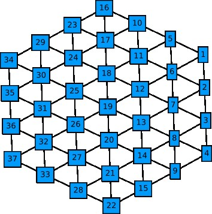
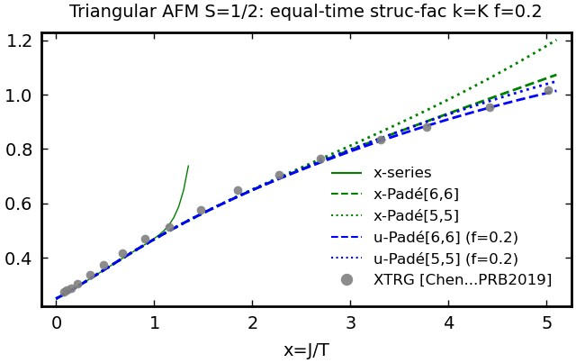
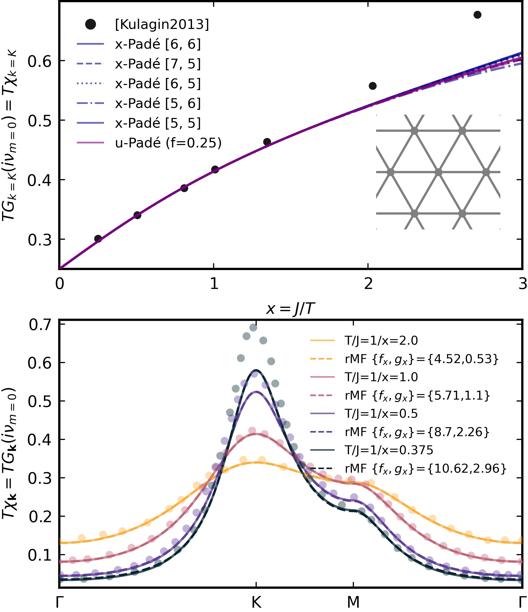
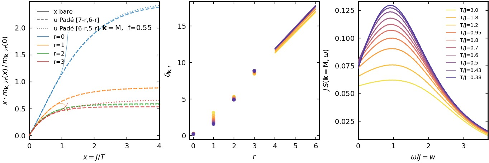
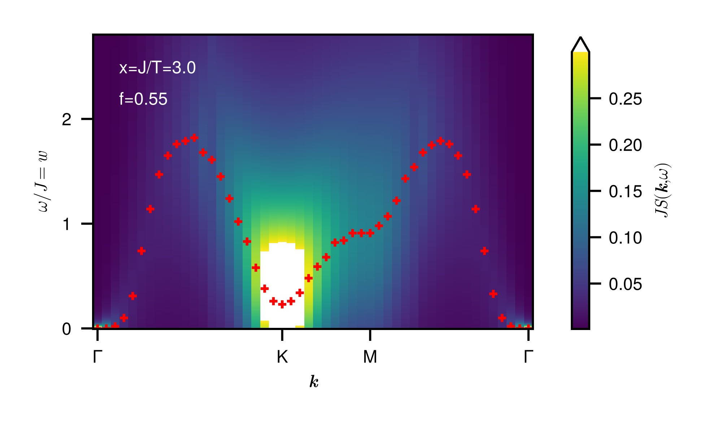

# Dynamic high-temperature expansion for quantum spins (Dyn-HTE) 

[](https://bsbierski.github.io/Dyn-HTE/)

by Ruben Burkard, Benedikt Schneider, Björn Sbierski 

This software allows to compute dynamic spin correlations (also known as dynamic structure factors) of spin-S Heisenberg models in thermal equilibrium via a high-temperature expansion (HTE) of the Matsubara spin-spin correlator. It is currently applicable for $S \leq 1$ models with a single coupling constant $J$, but arbitrary lattice geometry.

$$ H=J\sum_{(ii^\prime)}\left(S_{i}^{+}S_{i^\prime}^{-}+S_{i}^{-}S_{i^\prime}^{+}+S_{i}^{z}S_{i^\prime}^{z}\right) $$

Dyn-HTE obtains the HTE of the Matsubara spin-spin correlator

$$ G_{ii^\prime}(i\nu_{m})=T  \int_{0}^{\beta} \mathrm{d}\tau\mathrm{d}\tau^{\prime}\,e^{i\nu_{m}(\tau-\tau^{\prime})} 
\left\langle \mathcal{T}S_{i}^{z}(\tau)S_{i^{\prime}}^{z}(\tau^{\prime})\right\rangle $$

and allows to post-process this information to find the dynamic spin structure factor (DSF)

$$ S(\mathbf{k},\omega) = \int_{-\infty}^{+\infty}  \frac{\mathrm{d}t}{2\pi N} \sum_{i,i^\prime}  exp(i\omega t-i\mathbf{k}\cdot(r_i - r_{i^\prime}))  \left\langle S_{i}^{z}(t)S_{i^\prime}^{z}\right\rangle $$


## Publication/Citation
The theory background for Dyn-HTE and various applications are provided in the following two publications:

[1] Ruben Burkard, Benedikt Schneider, Björn Sbierski, *High-temperature series expansion of the dynamic Matsubara spin correlator*, arxiv 2505.23699 (2025)

[2] Ruben Burkard, Benedikt Schneider, Björn Sbierski, *Dynamic correlations of frustrated quantum spins from high-temperature expansion*, arxiv 2505.14571 (2025)

If Dyn-HTE benefits your research, please acknowledge it by citing these references.

## Installation

The DynHTE.jl package can be installed by invoking the following command in the Julia REPL:
```julia
]  add https://github.com/bsbierski/Dyn-HTE/tree/package
```
Due to the size of the precomputed data, this can take a minute. 

## Documentation

The documentation is available online at: https://bsbierski.github.io/Dyn-HTE/

Alternatively, the documentation can be hosted locally by running the host_documentation.jl file. 


## Tutorial: Spin-1/2 Heisenberg AFM on triangular lattice
This tutorial explains the use of the Dyn-HTE software provided in this repository using the example of the nearest-neighbor S=1/2 Heisenberg AFM on the triangular lattice. The associated julia script can be found under "examples/Triangular_Lattice/Application_Triangular_Lattice.jl”. This script contains complete code, here we only highlight the most important functionalities specific to Dyn-HTE and assume the reader is familiar with the julia language and its plotting routines. The physical background and most of the results generated in this tutorial are discussed in the two publications mentioned in [Publication/Citation].

### Preparations: Define lattice and find Dyn-HTE for Matsubara correlator
To start, we need to include DynHTE and the packages (JLD2, DelimitedFiles) that manage file handling. This is the same for every application of Dyn-HTE.
```julia
using JLD2, DelimitedFiles,Polynomials,LinearAlgebra,LsqFit,Graphs
using DynHTE
import DynHTE: getSitePosition
include("../plotConventions.jl")
```

Next we fix the spin length to $S=1/2$ (also $S=1$ would be currently available) and load all the graph evaluations for this S for the maximum available order n_max=12.
```julia
spin_length = 1/2
n_max = 12
hte_graphs = load_dyn_hte_graphs(spin_length,n_max);
```
The triangular lattice is predefined in the script “LatticeGraphs.jl” and due to the maximum order n_max=12 we only need a piece of it with sites separated from a central site by L=n_max=12 nearest-neighbor bonds or less. Other predefined lattices available via their keywords are “chain”, “square”, “triang”(ular), “honeycomb”, “pyrochlore”, “kagome”. Other translation invariant geometries can be defined by adapting the function “get_finite_Lattice” in “LatticeGraphs.jl”. We also define the three special points in the Brillouin zone (BZ) that will be of interest to us later, the origin $\Gamma$  and $K=(2\pi/3,2\pi/\sqrt{3})$ and $M=(0,2\pi/\sqrt{3})$.

```julia
L = 12
hte_lattice = getLattice(L,"triang");
Γ,K,M = (0,0), (2*π/3,2*π/sqrt(3)), (0,2*π/sqrt(3))
```
Note that it is not necessary to proceed with a Dyn_HTE_Lattice structure, one can also define a SimpleGraph type of the “Graphs.jl” package which is useful for finite or irregular systems (see “SpinCluster.jl”). 
The lattice and in particular the site numbering can be visualized by the following line (it is advisable to do this with a smaller L, here L=3).
```julia
display(graphplot(hte_lattice.graph,names=1:nv(hte_lattice.graph),markersize=0.2,fontsize=8,nodeshape=:rect,curves=false))
```
<p align="center"></p>

Finally, we perform the embedding to compute the $c_{ii^{\prime}}^{(n)}(i\nu_{m})$ of Eq. (10) in [1], they are provided as vectors containing the prefactors in 

$$ c_{ii^{\prime}}^{(n)}(i\nu_{m})=c_{ii^{\prime},0}^{(n)}\delta_{0,m}+(1-\delta_{0,m})\sum_{l=2,4,6,...}c_{ii^{\prime},l}^{(n)}\frac{1}{(2\pi m)^{2l}}, $$

c.f. Eq. (17) in [1].
```julia
c_iipDyn_mat = get_c_iipDyn_mat(hte_lattice,hte_graphs);
```
Here, the site $i$ is pinned to one of the central basis sites (here in the L=3 example this is the single site with index 19, see figure) and $i^{\prime}$ takes on all other site indices. If this embedding function is used with a SimpleGraph instead where translation symmetry is not assumed, $i^{\prime}$ takes all possible site indices. However, the latter case is less efficient since the embedding with Dyn_HTE_Lattice structures automatically uses lattice symmetries. 

### Equal-time correlators (crosschecks)

As a crosscheck for Dyn-HTE we reproduce the HTE of the uniform susceptibility $\sum_{i^{\prime}}\left\langle S_{i}^{z}S_{i^{\prime}}^{z}\right\rangle$  found by Elstner et al in [PhysRevLett.71.10 (1993)]. As a first step we analytically sum the $c_{ii^{\prime}}^{(n)}(i\nu_{m})$ over Matsubara frequency to obtain the HTE of the equal-time correlators $\left\langle S_{i}^{z}S_{i^{\prime}}^{z}\right\rangle,$ this is done as follows:
```julia
c_iipEqualTime_mat = get_c_iipEqualTime_mat(c_iipDyn_mat)
```
We now sum over i to obtain the expansion coefficients of the uniform susceptibility in powers of (-x).
```julia
println( [sum(c_iipEqualTime_mat[i,1][n+1] for i in 1:hte_lattice.lattice.length) for n in 0:n_max]' )
```
This yields 
```julia
[1/4, 3/8, 3/8, 17/64, 75/512, 441/5120, 8143/122880, 23691/573440, 118351/13762560, -585353/123863040, 46090313/9909043200, 23370989/2076180480, 1154027593/581330534400]
```
which indeed agrees to the result of Elstner et al if their convention for expansion coefficients is taken into account.

We next consider the equal-time correlators in k-space, say at the K-point. We define a vector of inverse temperatures (x_vec) and obtain the Fourier transform to momentum space using the “get_c_k” function. The series expansion in x (instead of -x) is obtained by a simple sign-flip of the even-index entries (note the julia convention that the first element - here $x^{0}$ coefficient - is at index 1). Then the polynomial is obtained as p_x:
```julia
k,k_label = K,"K"
x_vec = collect(0:0.05:5.1)
coeffs_x = flipEvenIndexEntries(get_c_k(k , c_iipEqualTime_mat,hte_lattice))
p_x = Polynomial(coeffs_x)
```
<p align="center"></p>

The evaluation of the bare series (p_x) is shown in the figure (full green line). It diverges around x=1.5. For a better estimate, we evaluate Padé approximants using, e.g. for [6,6],
```julia
get_pade(p_x,6,6)
```

which provides a rational function that agrees well down to x=5 with the results of the exponential tensor renormalization group (XTRG, geometry YC6x12, D*=1000) by Chen et al in [PhysRevB.99.140404 (2019)] (gray dots). The series in $u=\mathrm{tanh}(fx)$ is obtained as follows from a linear transformation of the vector of expansion coefficients (we pick f=0.2 empirically for good agreement of the u-Padés, blue lines)
```julia
f=0.2 
ufromx_mat = get_LinearTrafoToCoeffs_u(n_max,f)
u_vec = tanh.(f .* x_vec)
p_u = Polynomial(ufromx_mat*coeffs_x)
```
This completes the crosschecking of the frequency-summed Dyn-HTE expansion.

### Static structure factor

We proceed to the study of the static susceptibility $\chi_{\mathbf{k}}\equiv G_{\mathbf{k}}(i\nu_{m}=0)$ at Matsubara index m=0. For $\mathbf{k} \neq 0$ this lies beyond the capabilities of conventional HTE. First we obtain the real-space static susceptibility (with $i^\prime$ the central site) using the function
```julia
TGiip_Matsubara_xpoly(c_iipDyn_mat,i,1,m)
```

and then compute the spatial Fourier transform by hand (using the cosine due to inversion symmetry and the function for the real-space position of lattice site i
```julia
getSitePosition(hte_lattice.lattice,i)
```
as follows:
```julia
p_x = sum([cos(dot(k,getSitePosition(hte_lattice.lattice,i) 
.- getSitePosition(hte_lattice.lattice,hte_lattice.basis_positions[1]))) 
* get_TGiip_Matsubara_xpoly(c_iipDyn_mat,i,1,m) for i in 1:hte_lattice.lattice.length])
```
For k=K the resulting x-Padés and u-Padés (f=0.25) which are computed from the x-series as above are shown in the top panel of the figure. There we also compare to the bold line diagrammatic Monte Carlo of Kulagin et al [PhysRevB.87.024407(2013)], see dots. Finally we can repeat the above calculation of $\chi_{\mathbf{k}}$ for $\mathbf{k}$ sampled uniformly along a path through the BZ (see bottom panel of figure). This path ($Γ\rightarrow K\rightarrow M\rightarrow Γ$) with Nk+1 $\mathbf{k}$-points and the tick labels at the points defining the polygon is obtained conveniently with:
```julia
path = [Γ,K,M,Γ]
pathticks = ["Γ","K","M","Γ"]
Nk = 200
k_vec,kticks_positioins = create_brillouin_zone_path(path, Nk)
```
<p align="center"></p>

### Dynamic structure factor at k=M

We now proceed to the DSF defined above. We wish to work at the point $\mathbf{k}=M$ in momentum space. As a first step we Fourier transform the expansion coefficients $c_{ii^{\prime}}^{(n)}(i\nu_{m})$ and then compute the HTE series of the moments $m_{\mathbf{k},2r}(x)$ in $x$ for $r=0,1,...,6$:
```julia
k,k_label = M,"M"
c_kDyn = get_c_k(k,c_iipDyn_mat,hte_lattice)
m_vec = get_moments_from_c_kDyn(c_kDyn)
```
We normalize the moments as in the left panel of the figure below. This is done as follows:
```julia
poly_x = Polynomial([0,1],:x)
xm_norm_r = coeffs(poly_x * (m_vec[1+r]/m_vec[1+r](0)))
```
Like for the other quantities obtained from (Dyn-)HTE above, the bare series diverges already for $x=O(1)$ but the two u-Padés [7-r,6-r] and [6-r,5-r] (dashed and dotted lines) agree reasonably well down to $x=4$ for the first four moments $r=0,1,2,3$ if we choose $f=0.55$. We continue with these four moments in the following. We warn the reader that the transformation $u=\mathrm{tanh}(fx)$ shows an unphysical freezing at large $x \gtrsim 2/f$, so results for larger $x$ must be considered as unphysical.

Next we fix a set of particular (inverse) temperatures at which we obtain the moments from the u-Padé approximant [7-r,6-r]. 
```julia
x0_vec = 1 ./ [3.0,1.8,1.2,0.95,0.8,0.7,0.6,0.5,0.43,0.38]
```
For each temperature x0 we can now convert the numerical values of the moments in the list m0 to the continued fraction parameters $\delta_{\mathbf{k},r}$ shown in the middle panel as dots.
```julia
δ_vec,r_vec = fromMomentsToδ(m0_vec[x0_pos])
```

Finally, we obtain the DSF $JS(\mathbf{k},\omega)$ for a vector of dimensionless energies $w=\omega/J$. We use linear extrapolation of the $\delta_{\mathbf{k},r}$ for $r>3=r_{max}$ using a linear function through the origin and $\delta_{\mathbf{k},3}$ (straight lines in the middle panel). This particular choice of termination function for the continued fraction is controlled by the arguments of the extrapolation function. 
```julia
w_vec = collect(0.0:0.02:3.7)
JSw_vec = [JSwithTerminator(δ_vec,x0,w,get_extrapolation_params(δ_vec,r_max,r_max,true)) for w in w_vec]
```
The result for all temperatures $1/x_{0}$ is shown in the right panel.
<p align="center"></p>

### Dynamic structure factor (DSF): k-path through BZ

Finally we can compute the DSF on a path trough the BZ (at $x=3$) similar as for the static structure factor $\chi_{\mathbf{k}}$. One subtlety is to avoid the exact $\Gamma$ point, since the corresponding observable $\sum_{i}S_{i}^{z}$ is a conserved quantity. Thus it has no dynamics and the moments beyond order $r=0$ are trivial. We instead use a point close by the $\Gamma$  point. The red markers in the figure denote the energy at which the maximum intensity appears for a given momentum on the slice.
```julia
path = [(0.0001,0.0001),K,M,(0.0001,0.0001)]
pathticks = ["Γ","K","M","Γ"]
Nk = 49
k_vec,kticks_positioins = create_brillouin_zone_path(path, Nk)
```
<p align="center"></p>

## Implementing New Lattice Geometries

This library supports several common lattice geometries out-of-the-box (chain, square, triangular, honeycomb, kagome, pyrochlore, etc.), but you can also implement your own custom lattice geometry. This functionality is built on top of the `Lattice` module from SpinMC.jl.

### How to Add a New Lattice Geometry

To implement a new lattice geometry, you need to add a new case to the `get_finite_Lattice` function in `LatticeGraphs.jl`. Follow these steps:

1. **Define lattice vectors**: These are the primitive vectors of your unit cell
2. **Create a unit cell**: Use the lattice vectors to create a `UnitCell` object
3. **Add basis sites**: Add one or more sites to the unit cell using their fractional coordinates
4. **Define interactions**: Connect sites together to form the lattice structure
5. **Set lattice dimensions**: Define the size of the lattice

### Example

Here's a simple example showing how the square lattice is implemented:

```julia
elseif geometry == "square" ### Square lattice
    a1 = (1, 0)              # First lattice vector
    a2 = (0, 1)              # Second lattice vector
    uc = UnitCell(a1,a2)     # Create the unit cell

    b0 = addBasisSite!(uc, (0.0, 0.0))  # Add a basis site at the origin

    # Add nearest-neighbor interactions
    addInteraction!(uc, b0, b0, (1, 0))  # Connect to neighbor in a1 direction
    addInteraction!(uc, b0, b0, (0, 1))  # Connect to neighbor in a2 direction

    l = (L, L)  # L×L lattice
```

### Implementing a Custom Lattice

To add your own lattice (for example, a "custom_lattice"), add a new `elseif` condition:

```julia
elseif geometry == "custom_lattice"
    # 1. Define lattice vectors
    a1 = (x1, y1)  # Replace with your vector components
    a2 = (x2, y2)  # Replace with your vector components
    uc = UnitCell(a1, a2)
    
    # 2. Add basis sites
    b0 = addBasisSite!(uc, (pos_x0, pos_y0))
    b1 = addBasisSite!(uc, (pos_x1, pos_y1))
    # Add more sites as needed
    
    # 3. Add interactions between sites
    # Format: addInteraction!(uc, source_site, target_site, (unit_cell_offset))
    addInteraction!(uc, b0, b1, (0, 0))  # Connect sites in same unit cell
    addInteraction!(uc, b0, b0, (1, 0))  # Connect to next unit cell in a1 direction
    
    # 4. Set lattice dimensions
    l = (L, L)  # Usually L×L for 2D lattices
```

### Notes

- For 3D lattices, add a third lattice vector `a3` and create the unit cell with `UnitCell(a1, a2, a3)`
- The `addInteraction!` function creates bidirectional connections between sites
- The unit_cell_offset tuples `(n1, n2)` or `(n1, n2, n3)` specify how many unit cells to move in each lattice vector direction

After implementing your lattice, you can create it using:

```julia
mylattice, mygraph = get_finite_Lattice(L, "custom_lattice", PBC=true)
```

## Adding Symmetry Groups for New Lattices

The library includes functionality to reduce computational complexity by exploiting lattice symmetries. This tutorial explains how to define symmetry groups for custom lattices in the `getSymmetryGroup` function.

### Understanding Symmetry Elements

At the core of lattice symmetries are symmetry elements represented by the `sym_element` struct, which consists of two components:

```julia
mutable struct sym_element
    gMat    ::Matrix{Float64}  # Transformation matrix (rotation, reflection, etc.)
    gVec    ::Vector{Float64}  # Translation vector
end
```

When a symmetry element `g` acts on a position vector `r`, it applies:
- First, the rotation/reflection: `gMat * r`
- Then, the translation: `gMat * r + gVec`

For example:
- A pure rotation around the origin has `gVec = [0, 0, ...]`
- A pure translation has `gMat = I` (identity matrix)
- A non-symmorphic symmetry combines both non-trivial `gMat` and `gVec`

### How to Add a New Symmetry Group

To implement a symmetry group for a new lattice, add a new case to the `getSymmetryGroup` function:

1. **Define the lattice vectors** to create the translation group
2. **Create basic symmetry elements** (rotations, reflections, etc.)
3. **Build a basis** of symmetry elements
4. **Generate the full symmetry group**

### Example: Square Lattice Symmetry Group

Here's how the square lattice symmetry group is implemented:

```julia
elseif geometry == "square"
    # 1. Define lattice vectors
    a1 = (1, 0)
    a2 = (0, 1)

    # 2. Create basic symmetry elements
    C_4 = sym_element([0 1; -1 0], [0,0])  # 90° rotation
    Px = sym_element([-1 0; 0 1], [0,0])   # Mirror reflection across y-axis

    # 3. Build a basis with these elements
    basis = sym_group([neutral_elem(C_4), C_4, Px])
    
    # 4. Define the translation group
    translation_Group = translation_group([a1,a2])
    
    # 5. Generate the full symmetry group
    symmetry_Group = generate_symmetry_group(basis, translation_Group)
```

### Adding Your Custom Symmetry Group

To add a symmetry group for your custom lattice:

```julia
elseif geometry == "custom_lattice"
    # 1. Define lattice vectors
    a1 = (...)
    a2 = (...)
    # Add a3 for 3D lattices
    
    # 2. Create symmetry elements
    # Point group operations (rotations, reflections)
    R = sym_element([...], [...])   # Rotation matrix and translation vector
    M = sym_element([...], [...])   # Mirror/reflection
    
    # For non-symmorphic symmetries:
    NS = sym_element([...], [...])  # Matrix and fractional translation
    
    # 3. Create the basis
    basis = sym_group([neutral_elem(R), R, M, NS])
    
    # 4. Define translation group
    translation_Group = translation_group([a1, a2])
    
    # 5. Generate full symmetry group
    symmetry_Group = generate_symmetry_group(basis, translation_Group)
```
## Project Structure

### Data Folders
* **data/**
  * **GraphEvaluations/** - Contains graph evaluations "C_n.jld2" for S=1/2 and S=1, sorted by expansion order (n=0,1,...,12)
  * **GraphFiles/** - Contains graph(G) files "graphsG_n.jld2" sorted by expansion order, with associated unique graphs for faster embedding 

### Example Applications
* **examples/** - Contains implementations from publications [1],[2], including:
  * Chain lattice examples
  * Honeycomb lattice examples
  * Kagome lattice examples
  * Pyrochlore lattice examples
  * Square lattice examples
  * Triangular lattice examples

### Documentation
* **tutorialFigures/** - Contains images used in the tutorial documentation

### Source Code 
* **src/**
    * **ConvenienceFunctions.jl** - Helper functions for evaluating and plotting Dyn-HTE results
    * **DynHTE.jl** - Main module file
    * **Embedding.jl** - Handles embedding factors calculation and expansion coefficients of $TG_{ii\prime}(i\nu_m)$
    * **GraphGeneration.jl** - Graph handling functionality using Graphs.jl and SimpleWeightedGraphs.jl
    * **Lattice.jl** - Core lattice functionality from SpinMC.jl
    * **LatticeGraphs.jl** - Generates lattices/lattice balls with geometries like chain, square, triangle, etc.
    * **LatticeSymmetries.jl** - Handles symmetry analysis to optimize $G_{ii^\prime}(i\nu_m)$ calculations
    * **Structs.jl** - Core data structures (Graph, GraphG, lattice representations)
    * **vf2_edited.jl** - Modified VF2 algorithm for graph isomorphism computations

### Tests
* **test/** - Contains test files for the project components

